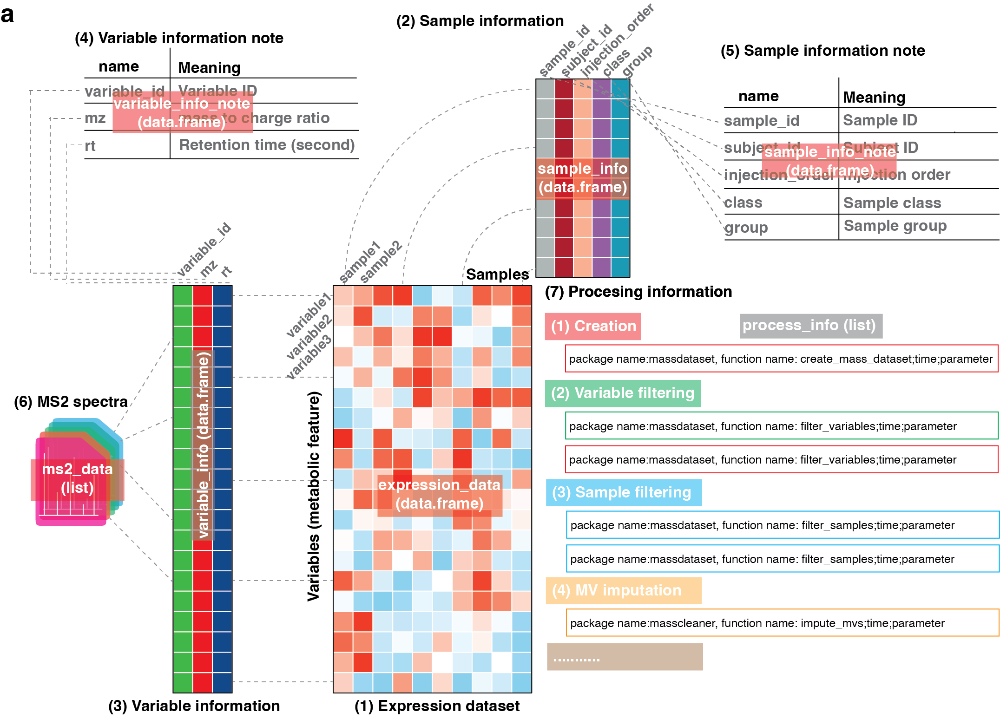

<!-- README.md is generated from README.Rmd. Please edit that file -->

# massdataset 

[](https://cran.r-project.org/package=massdataset)
[](https://github.com/tidymass/massdataset)
[](https://cran.r-project.org/package=massdataset)
[](https://www.tidyverse.org/lifecycle/#experimental)

`massdataset` is a part of [tidymass](https://tidymass.github.io/tidymass/).

------

## About

`massdataset` aims to organize the metabolomics data sets into a standard structure (mass_dataset class) which can be processed by all the packages from tidymass.

Merging separate data objects is useful for manually-imported data objects, especially for metabolomics data analysis. It's significant to keep unified format before analysis. While the first category of merging functions is useful for direct manipulations of the data for analytical purposes, `massdataset` is a convenience/support tool to help get your data into the right format.

`massdataset` also combines different functionalities in order to provide an easy way to process MS1/MS2 data and extract data sets.



## Installation

You can install `massdataset` from
[Github](https://github.com/tidymass/massdataset).

``` r
if(!require(devtools)){
install.packages("devtools")
}
devtools::install_github("tidymass/massdataset")
```

## Get started

Please see the "Help documents".

## Need help?

If you have any questions about `massdataset`, please don’t hesitate to
email me (<shenxt@stanford.edu>) or reach out me via the social medias below.

<i class="fa fa-weixin"></i>
[shenxt1990](https://www.shenxt.info/files/wechat_QR.jpg)

<i class="fa fa-envelope"></i> <shenxt@stanford.edu>

<i class="fa fa-twitter"></i>
[Twitter](https://twitter.com/JasperShen1990)

<i class="fa fa-map-marker-alt"></i> [M339, Alway Buidling, Cooper Lane,
Palo Alto, CA
94304](https://www.google.com/maps/place/Alway+Building/@37.4322345,-122.1770883,17z/data=!3m1!4b1!4m5!3m4!1s0x808fa4d335c3be37:0x9057931f3b312c29!8m2!3d37.4322345!4d-122.1748996)

## Citation

If you use massdataset in you publication, please cite this publication:

X. Shen, R. Wang, X. Xiong, Y. Yin, Y. Cai, Z. Ma, N. Liu, and Z.-J.
Zhu\* (Corresponding Author), Metabolic Reaction Network-based Recursive
Metabolite Annotation for Untargeted Metabolomics, Nature
Communications, 2019, 10: 1516.  
[Web Link](https://www.nature.com/articles/s41467-019-09550-x).

Thanks very much!
