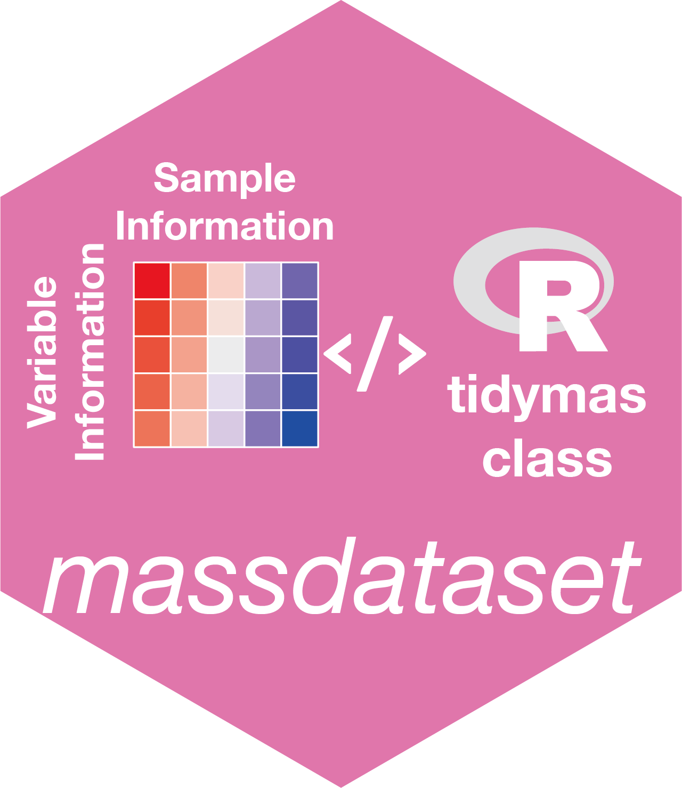
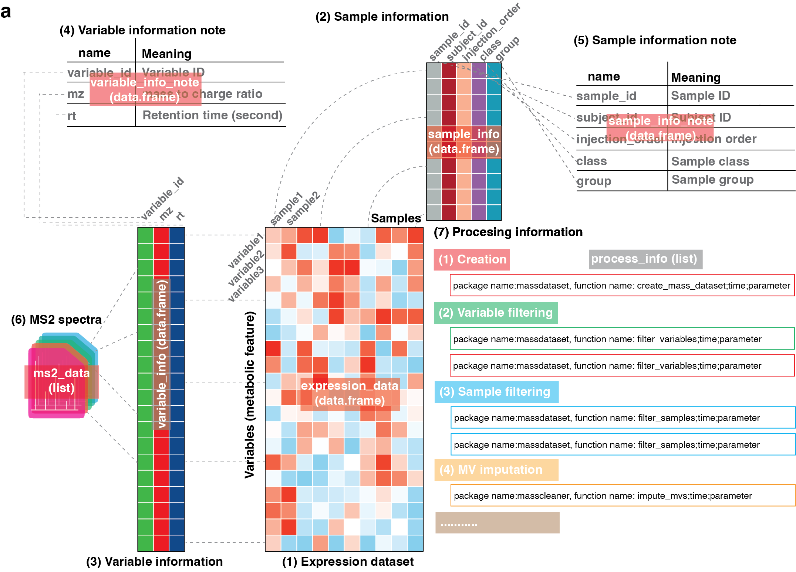

<!-- README.md is generated from README.Rmd. Please edit that file -->

# massdataset 

[](https://cran.r-project.org/package=massdataset)
[](https://github.com/tidymass/massdataset)
[](https://cran.r-project.org/package=massdataset)
[](https://www.tidyverse.org/lifecycle/#experimental)

`massdataset` is part of the [tidymass](https://www.tidymass.org/) ecosystem.

------

# About

`massdataset` provides the `mass_dataset` class for organizing rectangular small-molecule profiling datasets in a consistent structure. It also provides core utilities for creating, accessing, combining, summarizing, and converting `mass_dataset` objects across the broader [`tidymass`](https://www.tidymass.org/) ecosystem.



`massdataset` is designed as an infrastructure package. It helps you keep imported datasets in a unified format before downstream analysis and makes it easier to move between different tidymass tools without rewriting data containers.

# Installation

You can install the development version of `massdataset` from [GitHub](https://github.com/tidymass/massdataset).

``` r
if(!require(remotes)){
install.packages("remotes")
}
remotes::install_github("tidymass/massdataset")
```

Additional installation details are available [here](https://www.tidymass.org/massdataset/articles/massdataset_install.html).

# Get started

Start with the online documentation:

[massdataset articles](https://www.tidymass.org/massdataset/)

# Need help?

If you have questions about `massdataset`, contact me by email or through the channels below.

<i class="fa fa-weixin"></i>
WeChat: shenxt1990

<i class="fa fa-envelope"></i> <xiaotao.shen@outlook.com>

<i class="fa fa-twitter"></i>
[X](https://x.com/JasperShen1990)

# Citation

If you use `massdataset` in your publications, please cite this paper:

Shen, X., Yan, H., Wang, C. et al. TidyMass an object-oriented reproducible analysis framework for LC–MS data. Nat Commun 13, 4365 (2022). 

[Weblink](https://www.nature.com/articles/s41467-022-32155-w)

Thank you for using `massdataset`.
