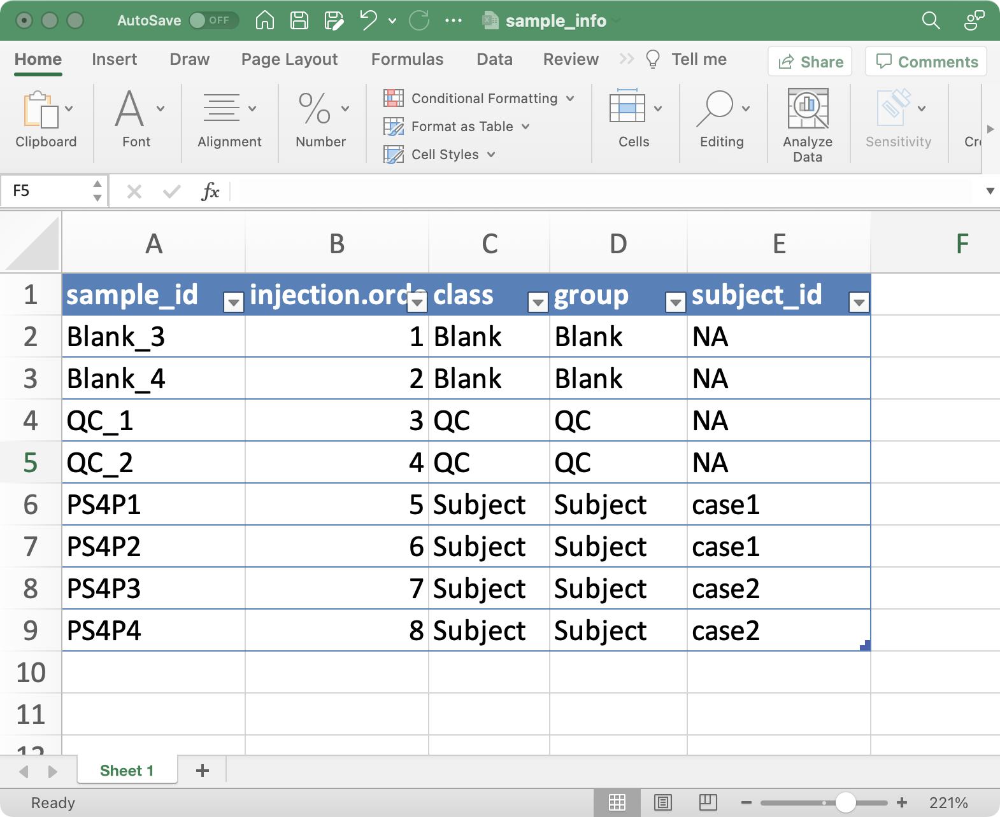

```{r, include = FALSE, echo=FALSE}
knitr::opts_chunk$set(
  collapse = TRUE,
  comment = "#>",
  warning = FALSE,
  message = TRUE,
  out.width = "100%"
)
```


# **Data preparation**

1. sample_info (required)



2. variable_info (required)

3. expression_data (required)

4. sample_info_note (optional)

5. variable_info_note (optional)

# **create_mass_dataset**

```{r,eval=TRUE,warning=FALSE, R.options="", message=FALSE, cache=TRUE}
library(massdataset)
library(tidyverse)

data("expression_data")
data("sample_info")
data("sample_info_note")
data("variable_info")
data("variable_info_note")
object =
  create_mass_dataset(
    expression_data = expression_data,
    sample_info = sample_info,
    variable_info = variable_info,
    sample_info_note = sample_info_note,
    variable_info_note = variable_info_note
  )
  
object
```

# **Export**

```{r,eval=TRUE,warning=FALSE, R.options="", message=FALSE, cache=TRUE}
dir.create("demo_data")
export_mass_dataset(object = object,
                    file_type = "xlsx",
                    path = "demo_data")
```
