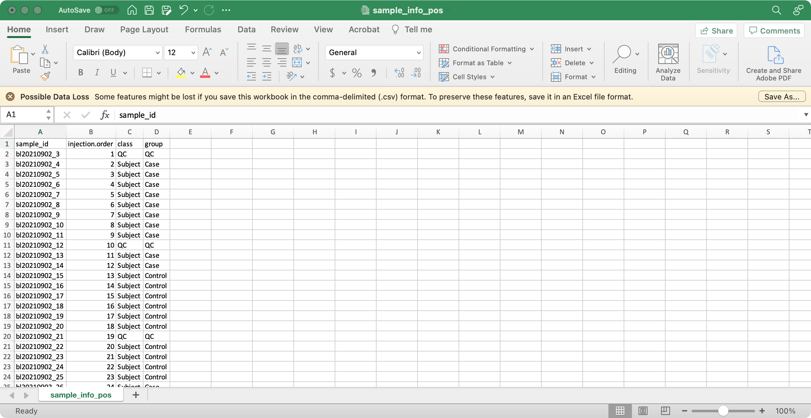
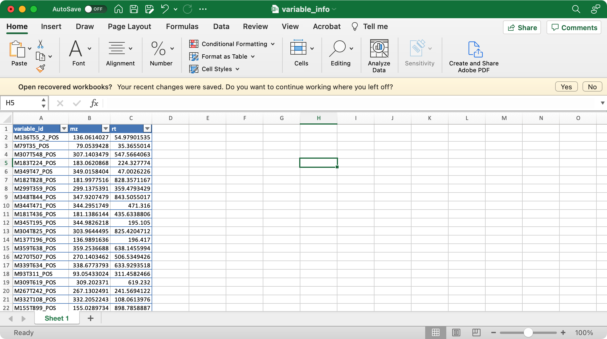
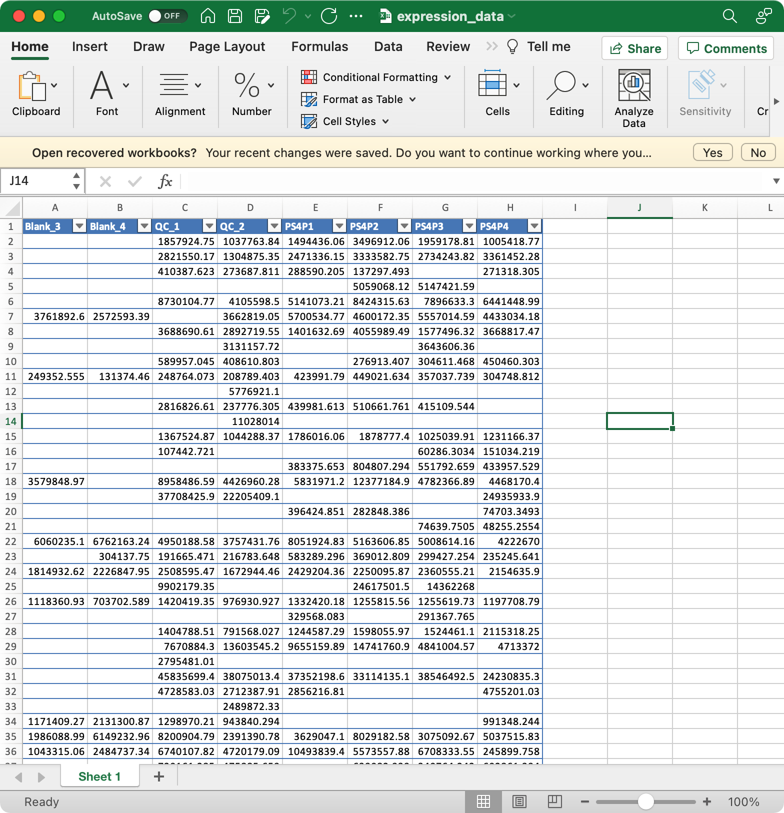
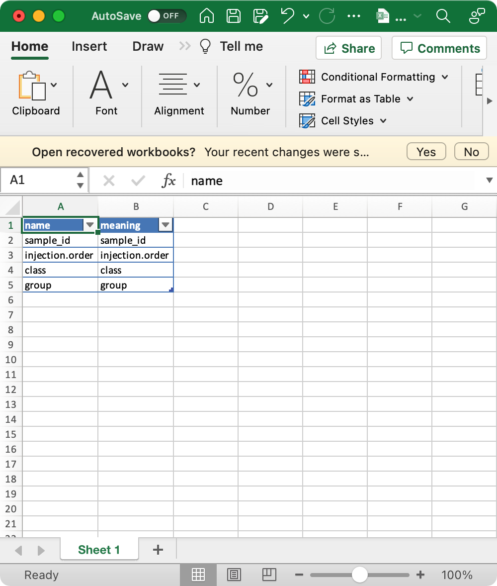
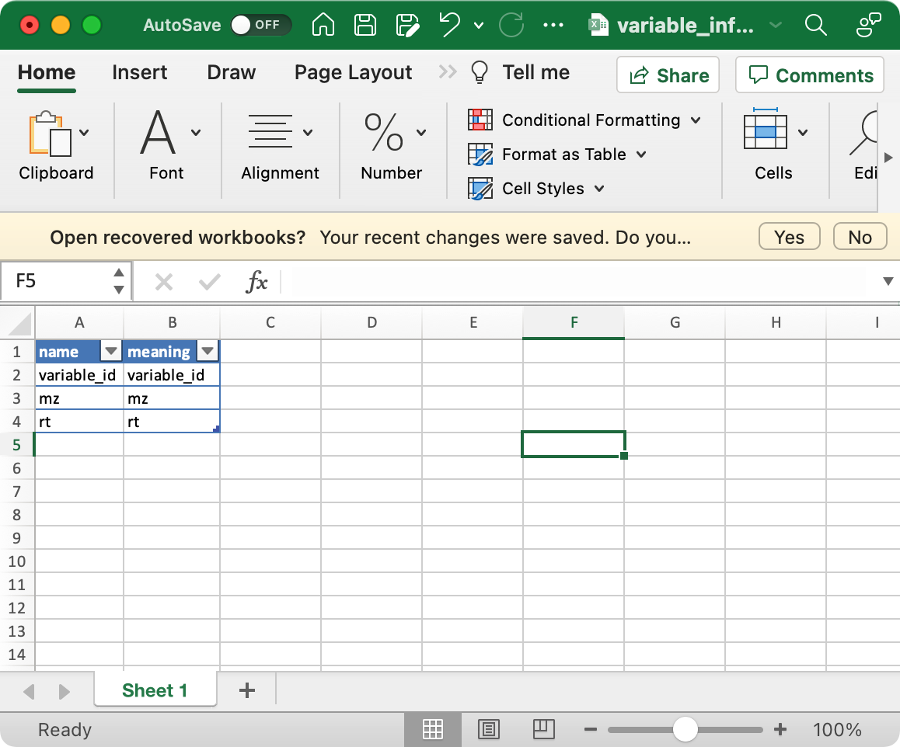
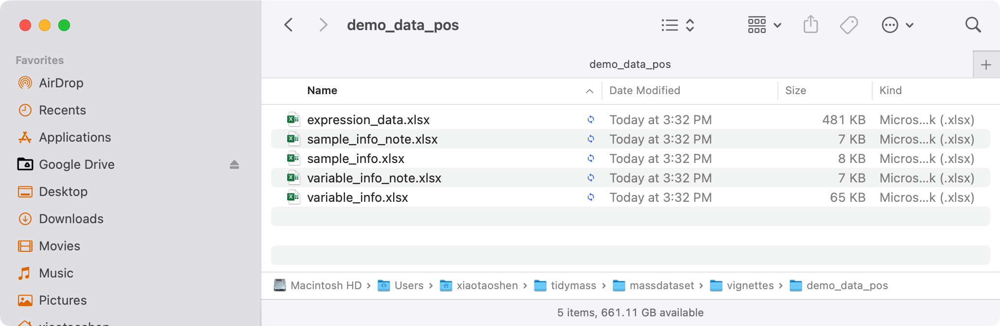

```{r, include = FALSE, echo=FALSE}
knitr::opts_chunk$set(
  collapse = TRUE,
  comment = "#>",
  warning = FALSE,
  message = TRUE,
  out.width = "100%"
)
```

# **Data preparation**

The `massdataset` class object can be used to store the untargeted metabolomics data.

Let's first prepare the data objects according to the attached figure for each file.

## 1. `sample_info` (required)

The columns `sample_id` (sample ID), `injection.order` (injection order of samples), `class` (Blank, QC, Subject, etc), `group` (case, control, etc) are required.



## 2. `variable_info` (required)

The columns `variable_id` (variable ID), `mz` (mass to charge ratio), `rt` (retention time, unit is second) are required.

 

## 3. `expression_data` (required)

Columns are samples are rows are features (variables).

> The column names of expression_data should be completely same with sample_id in `sample_info`, and the row names of expression_data should be completely same with variable_id in `variable_info`.



## 4. `sample_info_note` (optional)

This is the metadata for `sample_info`.



## 5. `variable_info_note` (optional)

This is the metadata for `variable_info`.



# **Prepare demo data**

Here we use the example datasets bundled with `massdataset`. This keeps the
workflow reproducible while still showing how the required tables fit together.

```{r,eval=TRUE,warning=FALSE, R.options="", message=TRUE, cache=FALSE}
library(massdataset)
library(tidyverse)
data("expression_data")
data("sample_info")
data("sample_info_note")
data("variable_info")
data("variable_info_note")

sample_info_pos = sample_info
sample_info_neg = sample_info
```

Make sure the order of samples in `sample_info` matches the columns of
`expression_data`.

```{r,eval=TRUE,warning=FALSE, R.options="", message=TRUE, cache=FALSE}
expression_data_pos = expression_data[, rev(seq_len(ncol(expression_data)))]
expression_data_neg = expression_data

colnames(expression_data_pos) == sample_info_pos$sample_id
colnames(expression_data_neg) == sample_info_neg$sample_id
```

The orders of `sample_id` in `sample_info` and column names of `expression_data` are different.

```{r,eval=TRUE,warning=FALSE, R.options="", message=TRUE, cache=FALSE}
expression_data_pos = 
  expression_data_pos[,sample_info_pos$sample_id]

colnames(expression_data_pos) == sample_info_pos$sample_id
colnames(expression_data_neg) == sample_info_neg$sample_id
```

# **Create `mass_data` class object**

Then we can create `mass_data` class object using `create_mass_dataset()` function.

```{r,eval=TRUE,warning=FALSE, R.options="", message=TRUE, cache=FALSE}
object_pos =
  create_mass_dataset(
    expression_data = expression_data_pos,
    sample_info = sample_info_pos,
    variable_info = variable_info,
    sample_info_note = sample_info_note,
    variable_info_note = variable_info_note
  )
  
object_pos
```

Then negative mode.

```{r,eval=TRUE,warning=FALSE, R.options="", message=TRUE, cache=FALSE}
object_neg =
  create_mass_dataset(
    expression_data = expression_data_neg,
    sample_info = sample_info_neg,
    variable_info = variable_info,
    sample_info_note = sample_info_note,
    variable_info_note = variable_info_note
  )
  
object_neg
```

Then save them for next analysis.

```{r,eval=TRUE,warning=FALSE, R.options="", message=TRUE, cache=FALSE}
save(object_pos, file = file.path(tempdir(), "object_pos"))
save(object_neg, file = file.path(tempdir(), "object_neg"))
```

# **Export `mass_dataset` class object to csv for xlsx**

```{r,eval=TRUE,warning=FALSE, R.options="", message=TRUE, cache=FALSE}
export_dir <- file.path(tempdir(), "demo_data_pos")
export_mass_dataset(object = object_pos,
                    file_type = "xlsx",
                    path = export_dir)

list.files(export_dir)
```

Then all the data will be in the temporary export folder.



# **mzMine feature table to `mass_dataset` class**

We can also directory convert feature table from [mzMine](http://mzmine.github.io/) to `mass_dataset` class.

An example feature table from mzMine.

```{r,eval=TRUE, echo=FALSE,warning=FALSE, R.options="",message=FALSE, cache=FALSE}

data("mzmine_table")
head_mzmine_table <- head(mzmine_table)
library(kableExtra)
library(magrittr)
kbl(head_mzmine_table) %>%
  kable_styling(bootstrap_options = c("striped", "hover", "condensed", "responsive"),
                fixed_thead = TRUE) %>%
  scroll_box(width = "100%", height = "600px")

```

```{r,eval=TRUE,warning=FALSE, R.options="", message=TRUE, cache=FALSE}
data("mzmine_table")
object =
   convet_mzmine2mass_dataset(x = mzmine_table)
object
```

# **MS-DIAL feature table to `mass_dataset` class**

We can also directly convert feature tables from MS-DIAL to a `mass_dataset` object.

An example feature table from MS-DIAL.

```{r,eval=TRUE, echo=FALSE,warning=FALSE, R.options="", message=FALSE, cache=FALSE}
data("msdial_table")
head_msdial_table <- msdial_table[1:7,]
library(kableExtra)
library(magrittr)
kbl(head_msdial_table) %>%
  kable_styling(bootstrap_options = c("striped", "hover", "condensed", "responsive"),
                fixed_thead = TRUE) %>% 
  scroll_box(width = "100%", height = "600px")
```

```{r,eval=TRUE,warning=FALSE, R.options="", message=TRUE, cache=FALSE}
data("msdial_table")
object =
   convert_msdial2mass_dataset(x = msdial_table)
object
```

# **Session information**

```{r,eval=TRUE,warning=FALSE, R.options="", message=TRUE, cache=FALSE}
sessionInfo()
```
